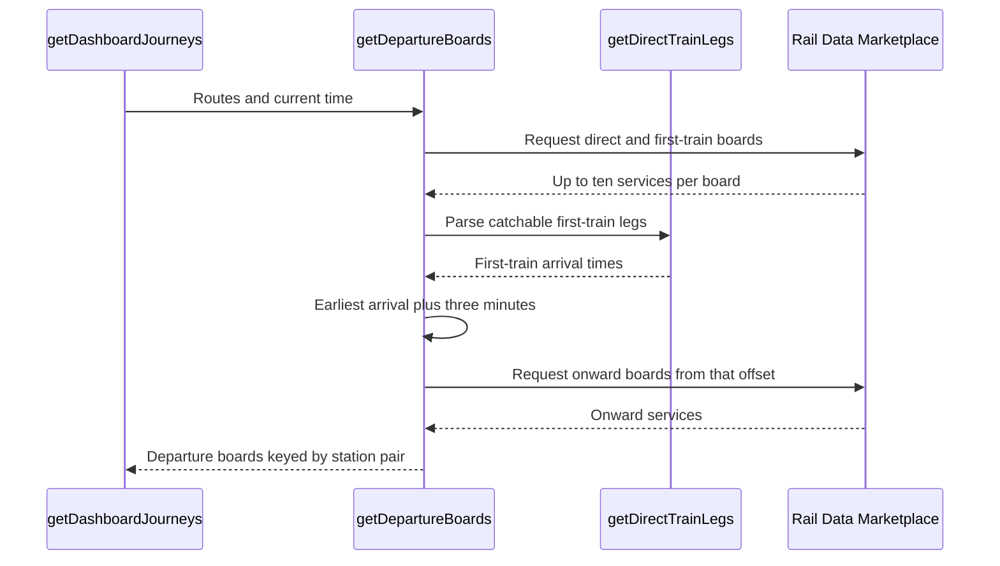

# Departure-board requests

The dashboard requests departure boards after it expands the active journey into station routes.

## Request sequence

## Request rules

Direct routes request the origin-to-destination board. The request starts after the configured origin walk.

Connected routes first request the origin-to-connection board. The app then finds the earliest catchable first-train arrival.

The onward request starts three minutes after that arrival. This avoids filling the ten-row response with trains that leave before the passenger arrives.

Each request asks for ten rows in a 120-minute window. The time offset is limited to 119 minutes.

Identical station-pair and offset requests share one promise during a planning request.

When several routes need different onward offsets for one station pair, the returned services are merged and deduplicated.

## Source map

- `src/trainDashboard/journeys/timetable/departureBoards.ts` creates requests, applies offsets, caches requests, and merges onward boards.
- `src/trainDashboard/journeys/timetable/trainLegs.ts` parses services and arrival times.
- `src/trainDashboard/api/railDataMarketplace.api.ts` sends and validates Rail Data Marketplace requests.
- `src/trainDashboard/dto/liveDepartureBoard.dto.ts` defines validated departure-board data.
