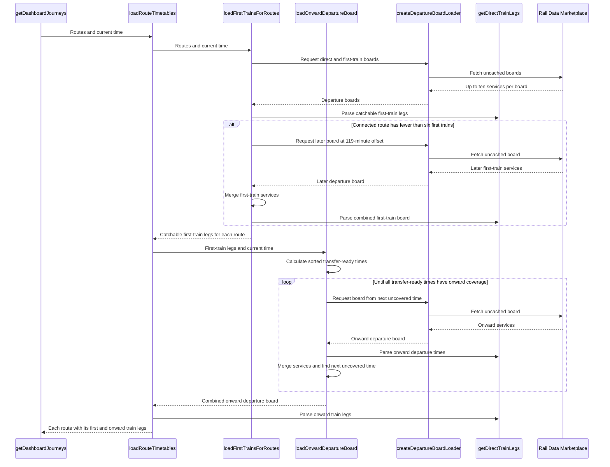

# Departure-board requests

The dashboard requests departure boards after it expands the active journey into station routes.

## Request sequence

## Request rules

Direct routes request the origin-to-destination board. The request starts after the configured origin walk.

Connected routes first request the origin-to-connection board. The app parses the catchable first trains before it requests onward trains.

If the first board has fewer than six catchable trains, the app requests one more board. This request uses the maximum 119-minute offset.

The app merges and deduplicates both first-train boards. It then finds the transfer-ready time for each catchable first train.

Each transfer-ready time is the first-train arrival plus three minutes. The first onward request starts at the earliest transfer-ready time.

The app compares the last onward departure with the remaining transfer-ready times. If a later first train is not covered, another request starts at its transfer-ready time.

The app repeats this process until no transfer-ready times remain. An empty response advances the process to the next transfer-ready time.

Each request asks for ten rows in a 120-minute window. The time offset is limited to 119 minutes.

Identical station-pair and offset requests share one promise during a planning request.

All responses for one station pair are merged and deduplicated. This includes overlapping responses and responses used by several routes.

`loadRouteTimetables` returns one `RouteTimetable` for each station route. A route timetable contains parsed first-train legs and optional onward-train legs.

`createDepartureBoardLoader` owns request keys and the request cache. `loadFirstTrainsForRoutes` owns the sparse first-train extension. `loadOnwardDepartureBoard` owns the repeated onward-window requests.

## Source map

- `src/trainDashboard/journeys/timetable/loadRouteTimetables.ts` loads the first and onward trains for each route.
- `src/trainDashboard/journeys/timetable/departureBoards.ts` creates requests, caches requests, and merges boards.
- `src/trainDashboard/journeys/timetable/firstTrainRequests.ts` loads and extends first-train boards.
- `src/trainDashboard/journeys/timetable/onwardTrainRequests.ts` loads the required onward-board windows.
- `src/trainDashboard/journeys/timetable/trainLegs.ts` parses services and arrival times.
- `src/trainDashboard/api/railDataMarketplace.api.ts` sends and validates Rail Data Marketplace requests.
- `src/trainDashboard/dto/liveDepartureBoard.dto.ts` defines validated departure-board data.
