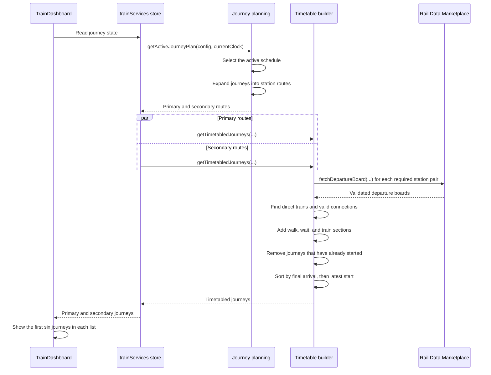
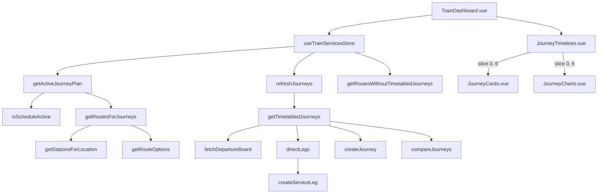

# Journey planning

The dashboard converts the current time and saved settings into journeys that a passenger can catch.

```text
Current time
      ↓
Active schedule
      ↓
Configured journeys
      ↓
Concrete station routes
      ↓
Departure-board requests
      ↓
Direct trains and valid connections
      ↓
Walking and waiting sections
      ↓
Remove journeys you cannot catch
      ↓
Sort by arrival
      ↓
Show the first six
```

## Sequence diagram



Primary and secondary planning share one departure-board request cache. A station-pair request occurs only once during each refresh.

## Call graph



## Source map

- `src/trainDashboard/store/trainServices.store.ts` coordinates each refresh.
- `src/trainDashboard/journeys/planning/activeJourneyPlan.ts` selects the active schedule.
- `src/trainDashboard/journeys/planning/journeyRoutes.ts` expands configured journeys into station routes.
- `src/trainDashboard/api/railDataMarketplace.api.ts` requests and validates departure boards.
- `src/trainDashboard/journeys/timetable/getTimetabledJourneys.ts` builds, filters, and sorts timetabled journeys.
- `src/trainDashboard/components/journeys/JourneyTimelines.vue` limits each displayed journey list to six results.

