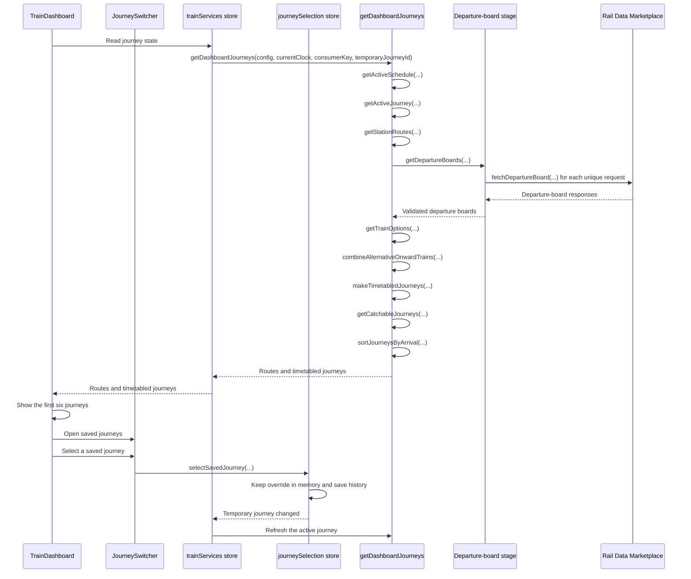
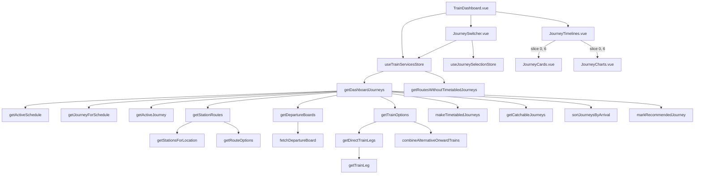

# Journey planning

The dashboard converts the current time and saved settings into journeys that a passenger can catch.

```text
Current time
      ↓
Active schedule
      ↓
Predicted journey
      ↓
Temporary saved-journey override, if selected
      ↓
Active journey
      ↓
Concrete station routes
      ↓
Departure-board requests
      ↓
Direct trains and valid connections
      ↓
Alternative trains grouped by shared first train
      ↓
Walking and waiting sections
      ↓
Remove journeys you cannot catch
      ↓
Sort by arrival
      ↓
Show the first six
```

## Sequence diagram



A station-pair request occurs only once during each planning request.

The temporary override exists only in memory. A page refresh restores the predicted journey. The saved selection remains in recent history.

Connection options that use the same first train are shown as one journey. The option that arrives first remains visible. Other onward trains appear as alternatives on the second leg.

## Call graph



## Source map

- `src/trainDashboard/store/trainServices.store.ts` coordinates each refresh.
- `src/trainDashboard/store/journeySelection.store.ts` keeps the temporary override and saves recent history.
- `src/trainDashboard/journeys/getDashboardJourneys.ts` shows the complete pipeline in order.
- `src/trainDashboard/journeys/planning/journeySelection.ts` selects the predicted and active journeys.
- `src/trainDashboard/journeys/planning/journeyRoutes.ts` expands configured journeys into station routes.
- `src/trainDashboard/journeys/timetable/departureBoards.ts` creates and deduplicates departure-board requests.
- `src/trainDashboard/api/railDataMarketplace.api.ts` requests and validates departure boards.
- `src/trainDashboard/journeys/timetable/trainOptions.ts` finds direct trains and valid connections.
- `src/trainDashboard/journeys/timetable/timetabledJourneys.ts` builds sections, filters journeys, and sorts results.
- `src/trainDashboard/components/journeys/JourneySwitcher.vue` shows saved journeys and applies temporary selections.
- `src/trainDashboard/components/journeys/JourneyTimelines.vue` limits the displayed journey list to six results.
