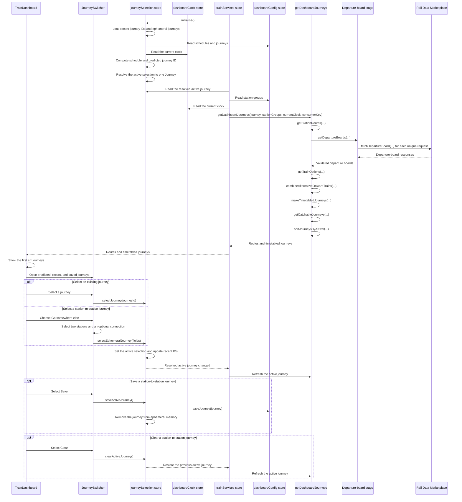

# Journey planning

The dashboard converts the current time and saved settings into journeys that a passenger can catch.

```text
Current time
      ↓
Active schedule
      ↓
Scheduled journey ID, or most recent valid journey ID
      ↓
Predicted journey ID
      ↓
Active selection: predicted, saved ID, or ephemeral ID
      ↓
Resolved active journey
      ↓
Concrete station routes
      ↓
Departure-board requests
      ↓
Direct trains and valid connections
      ↓
Alternative trains grouped by shared first train
      ↓
Walking and waiting sections
      ↓
Remove journeys you cannot catch
      ↓
Sort by arrival
      ↓
Show the first six
```

## Sequence diagram



A station-pair request occurs only once during each planning request.

A matching schedule supplies the predicted journey. If no schedule matches, the most recent valid journey supplies the prediction.

The prediction uses the history loaded when the page starts. A new selection remains a temporary override during that page session.

The selection store starts with explicit empty state. The train-services store calls `initialise()` before its first refresh. The action loads memory once.

The selection immediately appears in the Recent section. A page refresh can use it as the recent-history prediction.

Saved and ephemeral journeys use the same `Journey` shape. An ephemeral journey uses station endpoints and can include one connecting station.

The Save action adds the same journey to the configuration. Its ID stays the same unless that ID is already in use.

Recent history contains journey IDs only. Ephemeral journey definitions remain in journey memory while a recent or active selection refers to them.

The Clear action restores the journey that was active before the ephemeral journey. It does not add another recent-history entry.

Connection options that use the same first train are shown as one journey. The option that arrives first remains visible. Other onward trains appear as alternatives on the second leg.

## Call graph

```mermaid
flowchart TD
    dashboard[TrainDashboard.vue]
    store[useTrainServicesStore]
    pipeline[getDashboardJourneys]
    prediction[getJourneyPrediction]
    switcher[JourneySwitcher.vue]
    ephemeralForm[EphemeralJourneyForm.vue]
    maker[JourneyMaker.vue]
    selectionStore[useJourneySelectionStore]
    clockStore[useDashboardClockStore]
    configStore[useDashboardConfigStore]
    createEphemeral[createEphemeralJourney]
    stationInput[StationInput.vue]
    routes[getStationRoutes]
    stations[getStationsForLocation]
    options[getRouteOptions]
    boards[getDepartureBoards]
    api[fetchDepartureBoard]
    trains[getTrainOptions]
    direct[getDirectTrainLegs]
    service[getTrainLeg]
    alternatives[combineAlternativeOnwardTrains]
    sections[makeTimetabledJourneys]
    catchable[getCatchableJourneys]
    sort[sortJourneysByArrival]
    recommended[markRecommendedJourney]
    missing[getRoutesWithoutTimetabledJourneys]
    timelines[JourneyTimelines.vue]
    cards[JourneyCards.vue]
    charts[JourneyCharts.vue]

    dashboard --> store
    store --> pipeline
    store --> selectionStore
    store --> configStore
    store --> clockStore
    selectionStore --> prediction
    selectionStore --> configStore
    selectionStore --> clockStore
    pipeline --> routes
    routes --> stations
    routes --> options

    pipeline --> boards
    boards --> api
    pipeline --> trains
    trains --> direct
    trains --> alternatives
    direct --> service
    pipeline --> sections
    pipeline --> catchable
    pipeline --> sort
    pipeline --> recommended

    dashboard --> switcher
    dashboard --> clockStore
    switcher --> selectionStore
    switcher --> configStore
    switcher --> ephemeralForm
    ephemeralForm --> maker
    maker --> stationInput
    selectionStore --> createEphemeral

    dashboard --> missing
    dashboard --> timelines
    timelines -->|slice 0, 6| cards
    timelines -->|slice 0, 6| charts
```



## Source map

- `src/trainDashboard/store/trainServices.store.ts` initialises journey selection and refreshes train data for the resolved active journey.
- `src/trainDashboard/store/journeySelection.store.ts` owns explicit selection state, memory, choices, transitions, and its four user actions.
- `src/trainDashboard/store/dashboardClock.store.ts` owns the current dashboard clock and minute timer.
- `src/trainDashboard/store/dashboardConfig.store.ts` saves a journey in the configuration.
- `src/trainDashboard/dto/journeySelection.dto.ts` defines active selection and journey-memory shapes.
- `src/trainDashboard/journeys/journeyPrediction.ts` selects the active schedule and predicted journey ID.
- `src/trainDashboard/journeys/getDashboardJourneys.ts` shows the complete pipeline in order.
- `src/trainDashboard/journeys/planning/journeyRoutes.ts` expands journeys into station routes.
- `src/trainDashboard/journeys/timetable/departureBoards.ts` creates and deduplicates departure-board requests.
- `src/trainDashboard/api/railDataMarketplace.api.ts` requests and validates departure boards.
- `src/trainDashboard/journeys/timetable/trainOptions.ts` finds direct trains and valid connections.
- `src/trainDashboard/journeys/timetable/timetabledJourneys.ts` builds sections, filters journeys, and sorts results.
- `src/trainDashboard/components/journeys/JourneySwitcher.vue` shows journeys, opens the station picker, and shows the Save action.
- `src/trainDashboard/components/journeys/EphemeralJourneyForm.vue` owns the temporary journey draft and its Use and Cancel actions.
- `src/trainDashboard/components/journeys/JourneyMaker.vue` builds configured and ephemeral journeys from endpoints and an optional connection.
- `src/trainDashboard/components/settings/stationGroups/StationInput.vue` selects stations for journey endpoints and connections.
- `src/trainDashboard/components/journeys/JourneyTimelines.vue` limits the displayed journey list to six results.
