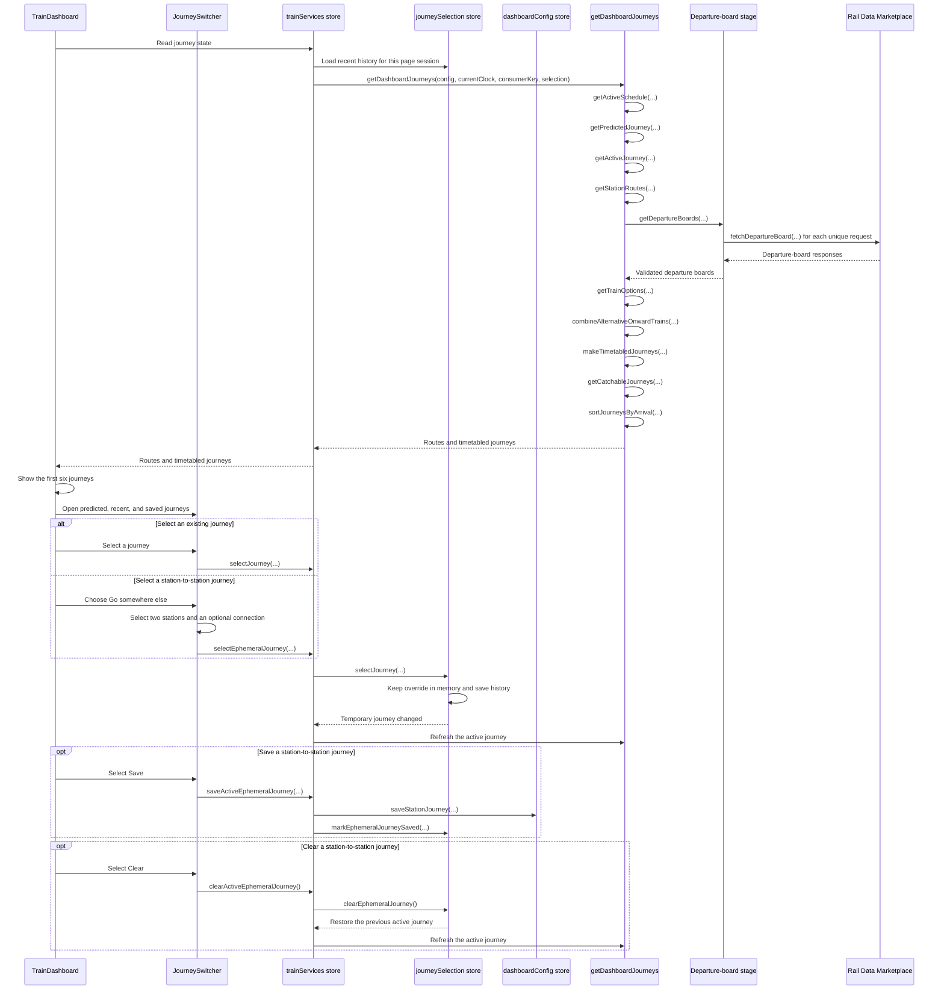

# Journey planning

The dashboard converts the current time and saved settings into journeys that a passenger can catch.

```text
Current time
      ↓
Active schedule
      ↓
Scheduled journey, or most recent valid journey
      ↓
Predicted journey
      ↓
Temporary saved or station-to-station override, if selected
      ↓
Active journey
      ↓
Concrete station routes
      ↓
Departure-board requests
      ↓
Direct trains and valid connections
      ↓
Alternative trains grouped by shared first train
      ↓
Walking and waiting sections
      ↓
Remove journeys you cannot catch
      ↓
Sort by arrival
      ↓
Show the first six
```

## Sequence diagram



A station-pair request occurs only once during each planning request.

A matching schedule supplies the predicted journey. If no schedule matches, the most recent valid journey supplies the prediction.

The prediction uses the history loaded when the page starts. A new selection remains a temporary override during that page session.

The selection immediately appears in the Recent section. A page refresh can use it as the recent-history prediction.

An ephemeral journey contains one origin station, one destination station, and an optional connecting station. Its walking times are unknown, so the header shows the time until the train departs.

The Save action converts an ephemeral journey into a configured journey. It also converts matching recent-history entries to the saved journey.

The Clear action restores the journey that was active before the ephemeral journey. It does not add another recent-history entry.

Connection options that use the same first train are shown as one journey. The option that arrives first remains visible. Other onward trains appear as alternatives on the second leg.

## Call graph

```mermaid
flowchart TD
    dashboard[TrainDashboard.vue]
    store[useTrainServicesStore]
    pipeline[getDashboardJourneys]
    active[getActiveSchedule]
    scheduled[getJourneyForSchedule]
    recent[getRecentJourneys]
    predicted[getPredictedJourney]
    selected[getActiveJourney]
    switcher[JourneySwitcher.vue]
    ephemeralForm[EphemeralJourneyForm.vue]
    maker[JourneyMaker.vue]
    selectionStore[useJourneySelectionStore]
    configStore[useDashboardConfigStore]
    createEphemeral[createEphemeralJourney]
    stationInput[StationInput.vue]
    routes[getStationRoutes]
    stations[getStationsForLocation]
    options[getRouteOptions]
    boards[getDepartureBoards]
    api[fetchDepartureBoard]
    trains[getTrainOptions]
    direct[getDirectTrainLegs]
    service[getTrainLeg]
    alternatives[combineAlternativeOnwardTrains]
    sections[makeTimetabledJourneys]
    catchable[getCatchableJourneys]
    sort[sortJourneysByArrival]
    recommended[markRecommendedJourney]
    missing[getRoutesWithoutTimetabledJourneys]
    timelines[JourneyTimelines.vue]
    cards[JourneyCards.vue]
    charts[JourneyCharts.vue]

    dashboard --> store
    store --> pipeline
    store --> selectionStore
    store --> active
    store --> predicted
    pipeline --> active
    pipeline --> predicted
    pipeline --> selected
    pipeline --> routes
    predicted --> scheduled
    predicted --> recent
    routes --> stations
    routes --> options

    pipeline --> boards
    boards --> api
    pipeline --> trains
    trains --> direct
    trains --> alternatives
    direct --> service
    pipeline --> sections
    pipeline --> catchable
    pipeline --> sort
    pipeline --> recommended

    dashboard --> switcher
    switcher --> store
    switcher --> ephemeralForm
    ephemeralForm --> maker
    maker --> stationInput
    store --> createEphemeral
    store --> configStore
    store --> selectionStore

    store --> missing
    dashboard --> timelines
    timelines -->|slice 0, 6| cards
    timelines -->|slice 0, 6| charts
```



## Source map

- `src/trainDashboard/store/trainServices.store.ts` coordinates each refresh.
- `src/trainDashboard/store/journeySelection.store.ts` keeps the temporary override and saves recent history.
- `src/trainDashboard/store/dashboardConfig.store.ts` saves an ephemeral station pair as a configured journey.
- `src/trainDashboard/dto/journeySelection.dto.ts` defines saved and ephemeral journey selections.
- `src/trainDashboard/dto/journeyHistory.dto.ts` validates saved and ephemeral recent-history entries.
- `src/trainDashboard/journeys/getDashboardJourneys.ts` shows the complete pipeline in order.
- `src/trainDashboard/journeys/planning/journeySelection.ts` selects recent, predicted, and active journeys.
- `src/trainDashboard/journeys/planning/journeyRoutes.ts` expands configured and ephemeral journeys into station routes.
- `src/trainDashboard/journeys/timetable/departureBoards.ts` creates and deduplicates departure-board requests.
- `src/trainDashboard/api/railDataMarketplace.api.ts` requests and validates departure boards.
- `src/trainDashboard/journeys/timetable/trainOptions.ts` finds direct trains and valid connections.
- `src/trainDashboard/journeys/timetable/timetabledJourneys.ts` builds sections, filters journeys, and sorts results.
- `src/trainDashboard/components/journeys/JourneySwitcher.vue` shows journeys, opens the station picker, and shows the Save action.
- `src/trainDashboard/components/journeys/EphemeralJourneyForm.vue` owns the temporary journey draft and its Use and Cancel actions.
- `src/trainDashboard/components/journeys/JourneyMaker.vue` builds configured and ephemeral journeys from endpoints and an optional connection.
- `src/trainDashboard/components/settings/stationGroups/StationInput.vue` selects stations for journey endpoints and connections.
- `src/trainDashboard/components/journeys/JourneyTimelines.vue` limits the displayed journey list to six results.
