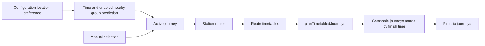
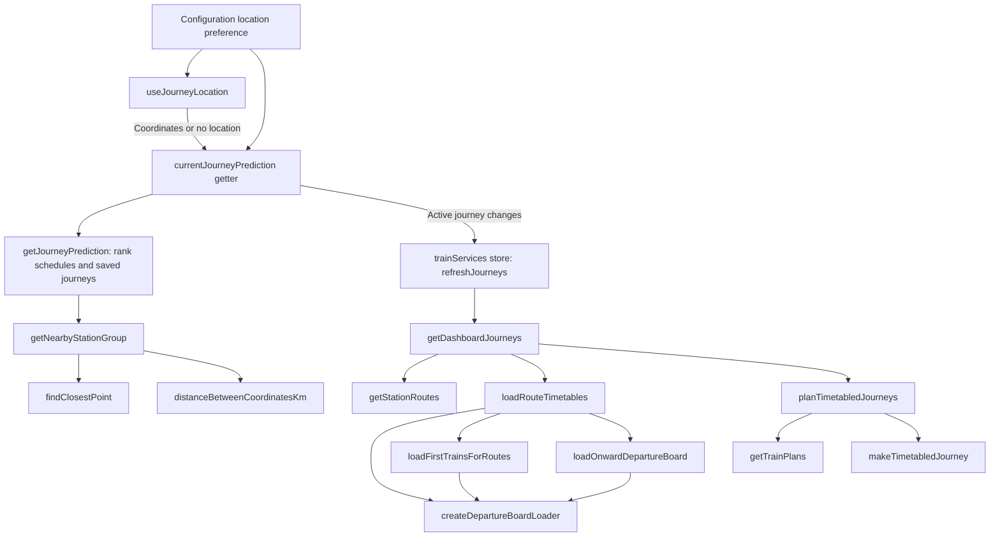
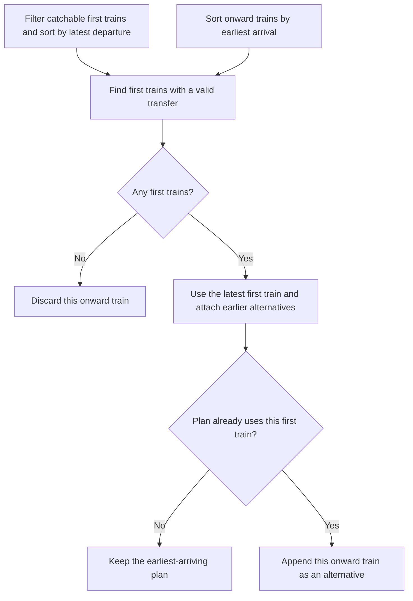
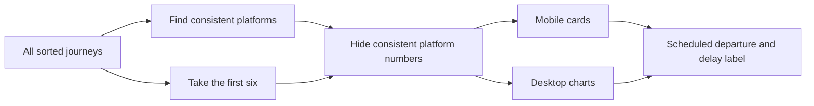
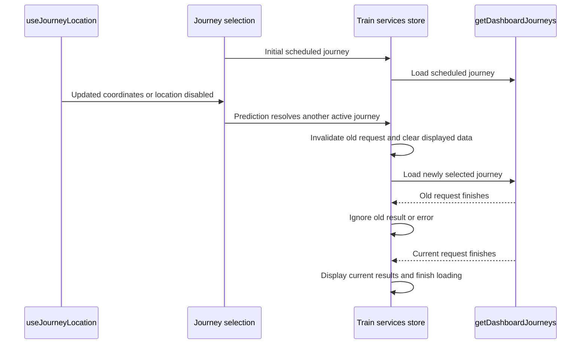

# Journey planning

Journey planning starts with one resolved active journey. See [journey selection](journey-selection.md) for how the app selects that journey.

Prediction alternatives include saved journeys from the nearby group, with scheduled journeys first. Without a nearby group, overlapping active schedules supply candidates in preference order. Alternatives do not load timetables until selected.

## Planning flow

`getStationRoutes` expands station groups into concrete origin and destination pairs. It removes pairs that use the same station.

A configured connecting station creates a direct route and a connected route. It creates only a direct route when the connecting station is an endpoint.

See [departure-board requests](departure-boards.md) for how the app loads direct, first-train, and onward trains.

Each route timetable contains its station route and parsed train legs. A direct route contains first-train legs only. A connected route also contains onward-train legs.

`planTimetabledJourneys` accepts route timetables. It hides train matching, connection rules, section construction, filtering, sorting, and recommendation.

## Call graph

## Connection construction

A catchable first train must meet all these rules:

- The passenger can complete the origin walk before departure.
- The first train arrives at least three minutes before the onward train departs.
- The first and onward trains have different service IDs.

## Filtering and ordering

The planner adds walk, train, and wait sections to each train plan.

It removes a journey when its first section starts before the current time. This includes the origin walk when its duration is known.

It sorts journeys by the end of the final section. This includes the destination walk when its duration is known.

When two journeys finish together, the journey that starts later comes first.

The first sorted journey with known origin and destination walking times is recommended.

## Presentation

The planner returns all sorted journeys. `JourneyTimelines` applies the six-journey display limit.

Platform consistency uses all planned journeys. A platform is hidden when multiple services use the same known platform for one station pair.

Departure labels show the scheduled time and an amber delay, such as `10:14 (+3m)`. Hover or keyboard focus shows the expected departure. National Rail links use the scheduled departure. Timeline positions, connections, filtering, and walking advice use expected times.

Location changes update prediction but do not replace a manual journey selection. Disabling location clears the position and returns prediction to active schedules. The active journey supplies the station routes for timetable planning.

The train services store clears displayed routes and trains when the active journey or station groups change.
Each refresh invalidates the previous request. Only the current request can update routes, trains, errors, or loading status.
Minute-based refreshes keep the current trains visible while updated trains load.

## Source map

- `src/trainDashboard/store/dashboardConfig.store.ts` stores the location preference.
- `src/composables/useJourneyLocation.ts` starts or stops geolocation and reports coordinates or errors.
- `src/trainDashboard/store/journeySelection.store.ts` owns selection state and supplies enabled coordinates to prediction.

- `src/trainDashboard/store/trainServices.store.ts` refreshes trains, clears data after journey changes, and ignores outdated requests.
- `src/trainDashboard/store/trainServices.store.test.ts` checks location changes and requests that finish out of order.
- `src/trainDashboard/journeys/getDashboardJourneys.ts` expands the active journey, loads route timetables, and calls the planner.
- `src/trainDashboard/journeys/planning/journeyRoutes.ts` expands a journey into concrete station routes.
- `src/trainDashboard/journeys/timetable/loadRouteTimetables.ts` loads the train legs for each station route.
- `src/trainDashboard/journeys/timetable/departureBoards.ts` owns cached departure-board requests and response merging.
- `src/trainDashboard/journeys/timetable/firstTrainRequests.ts` loads initial and sparse first-train boards.
- `src/trainDashboard/journeys/timetable/onwardTrainRequests.ts` loads enough onward windows for all transfer-ready times.
- `src/trainDashboard/journeys/timetable/planTimetabledJourneys.ts` owns planning rules and returns sorted, recommended journeys.
- `src/trainDashboard/journeys/timetable/trainPlans.ts` matches direct and connected train legs and selects alternatives.
- `src/trainDashboard/journeys/timetable/makeTimetabledJourney.ts` adds walk, wait, and train sections.
- `src/trainDashboard/journeys/timetable/trainLegs.ts` converts departure services into timed train legs.
- `src/trainDashboard/journeys/timetable/planTimetabledJourneys.test.ts` contains a worked connected-journey example.
- `src/trainDashboard/dto/timetabledJourney.dto.ts` defines the planned journey and section shapes.
- `src/trainDashboard/components/journeys/timetables/JourneyTimelines.vue` limits results and prepares platform display.
- `src/trainDashboard/components/journeys/timetables/mobile/JourneyCards.vue` shows mobile journeys.
- `src/trainDashboard/components/journeys/timetables/desktop/JourneyCharts.vue` shows desktop journeys.

- `src/trainDashboard/components/journeys/timetables/TrainDepartureLink.vue` shows scheduled departures and delay details for main and alternative trains.

- `src/trainDashboard/journeys/journeyPrediction.ts` selects the predicted journey and alternatives using time, schedule preference order, and the nearby origin group.
- `src/trainDashboard/journeys/nearbyStationGroup.ts` finds the nearest group within 2,000 metres.

- `src/utilities/location.utility.ts` calculates spherical distances and finds the closest point.

- `src/trainDashboard/journeys/journeyTimes.ts` selects whole-minute chart ticks and the visible time range.
- `src/trainDashboard/components/journeys/timetables/AlternativeTrains.vue` renders alternative departure links in both layouts.
- `src/trainDashboard/journeys/timetable/connectionTimetable.test.ts` checks connected journeys through the request and planning pipeline.
