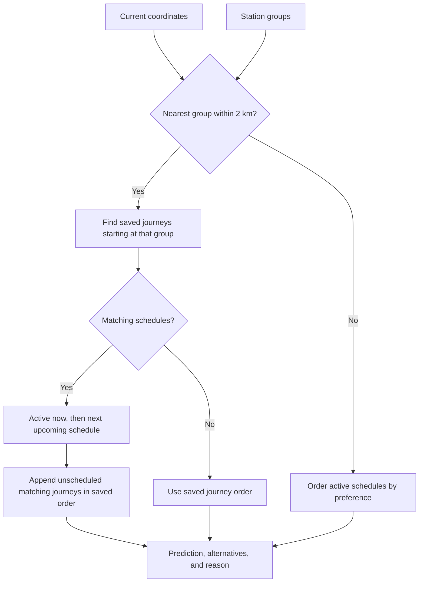
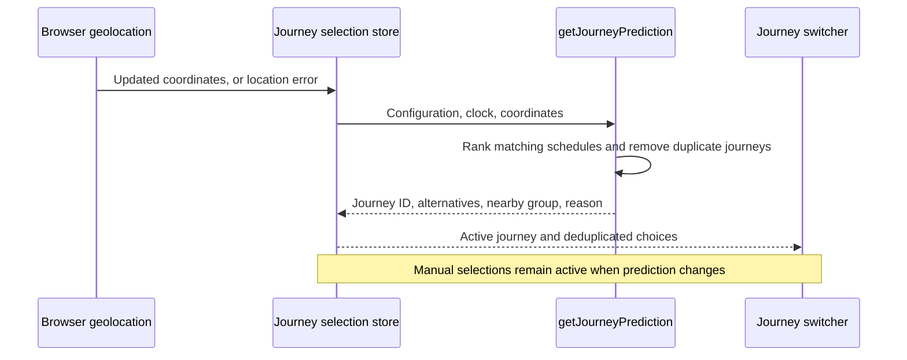
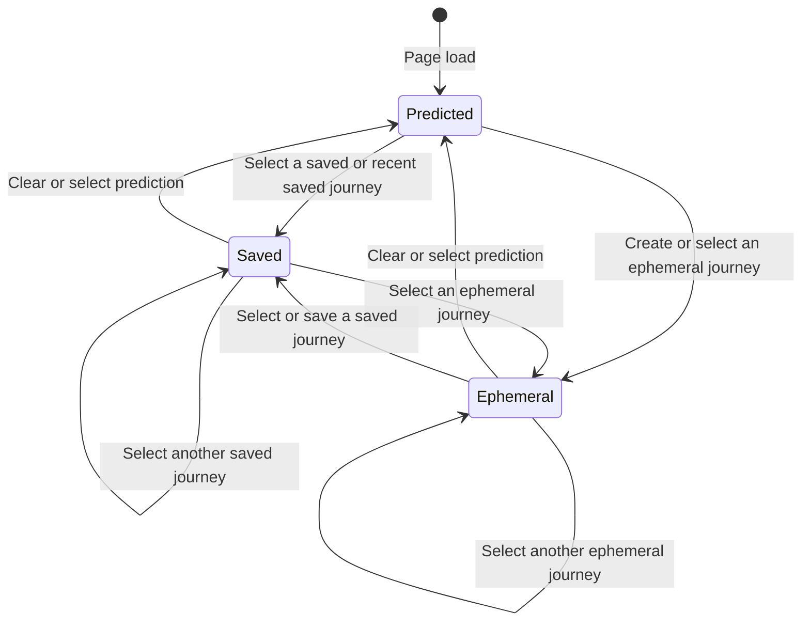
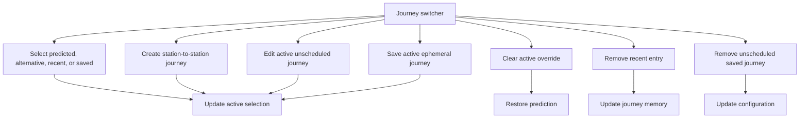

# Journey selection

Journey selection resolves one journey for the dashboard. It does not choose trains or stations.

## Prediction

Location can override the time-based prediction. The nearest group must have coordinates and be within 2,000 metres. Equal distances use group order.

A journey with an explicit origin group matches that group. A station-only origin matches when its station belongs to the nearby group.

Matching schedules take precedence over unscheduled journeys. An active schedule comes first, followed by the next start across the weekly schedule. Overlapping active schedules and equal upcoming start times use configuration order. Repeated schedules for one journey produce one candidate.

Unscheduled saved journeys from the nearby group follow the scheduled candidates in configuration order.

If no schedules match the group, saved journeys use configuration order. The first candidate becomes the prediction; the others become alternatives. If no journeys match, the result contains only the nearby group and its explanation.

Without a nearby group, active schedules use configuration order. The first journey becomes the prediction; other distinct journeys become alternatives. Recent history does not affect prediction. The prediction reason identifies the selected schedule.

Schedules can overlap. Use Move up and Move down in settings to put preferred schedules first. Save configuration applies the order; Cancel discards the change.

The store keeps latitude and longitude from geolocation updates. A location error clears the position so prediction returns to active schedules in preference order.

The switcher shows the nearby-group message for predicted and manually selected journeys. Only predicted journeys show the selection reason. Explanations use the group name, such as “from Home”. When no journey matches the nearby group, the message asks the user to choose a journey below. Choices appear as Predicted, Alternatives, Recent, and Saved, with each journey shown once.

## Active selection

The active selection has one of these shapes:

- `{type: "predicted"}` resolves the current predicted journey ID.
- `{type: "saved", id}` resolves one configured journey.
- `{type: "ephemeral"}` resolves the current ephemeral journey.

The active override stays only in the current page session. Page refresh and Clear restore the current prediction.

## Journey switcher actions

Selecting a temporary journey adds its ID to recent history. The switcher shows at most three recent journeys.

Recent history contains journey IDs. Ephemeral definitions remain in journey memory while a recent or active selection refers to them.

Saving an ephemeral journey adds it to the configuration. The active selection then becomes saved.

The switcher can edit or remove only unscheduled saved journeys. Removing a recent entry does not remove its saved journey.

The Journeys tab in settings lists all saved and recent journeys. Saved journeys can be edited, including journeys used by schedules. Each saved journey lists its schedules. Remove is disabled while a schedule uses the journey. Recent entries can be forgotten or added to saved journeys.

These settings actions update a draft. Save configuration applies the changes; Cancel discards them. Removing the active saved journey restores prediction. Saving the active temporary journey changes its selection to saved.

## Source map

- `src/trainDashboard/journeys/journeyPrediction.ts` combines time and location into a prediction, alternatives, and structured reason.
- `src/trainDashboard/store/journeySelection.store.ts` owns active selection, recent history, ephemeral journeys, and switcher actions.
- `src/trainDashboard/dto/journeySelection.dto.ts` defines selection and journey-memory shapes.
- `src/trainDashboard/store/dashboardClock.store.ts` supplies the current day and time.
- `src/trainDashboard/store/dashboardConfig.store.ts` supplies schedules and saved journeys.
- `src/trainDashboard/components/journeys/JourneySwitcher.vue` presents journey choices and actions.
- `src/trainDashboard/components/journeys/JourneyForm.vue` creates and edits journey fields.

- `src/trainDashboard/components/settings/journeys/SavedJourneysSettings.vue` edits saved journeys and manages recent entries in the settings draft.

- `src/trainDashboard/journeys/nearbyStationGroup.ts` uses the shared location utility and applies the nearby distance limit.
- `src/trainDashboard/components/journeys/JourneyPredictionExplanation.vue` explains the rule that selected the journey.

- `src/utilities/location.utility.ts` calculates spherical distances and finds the closest point.
