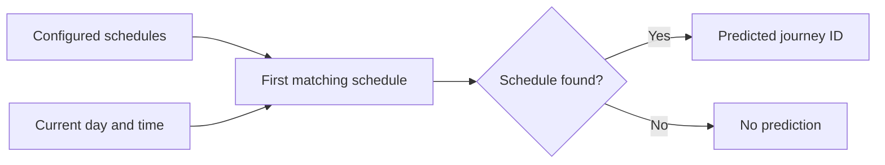
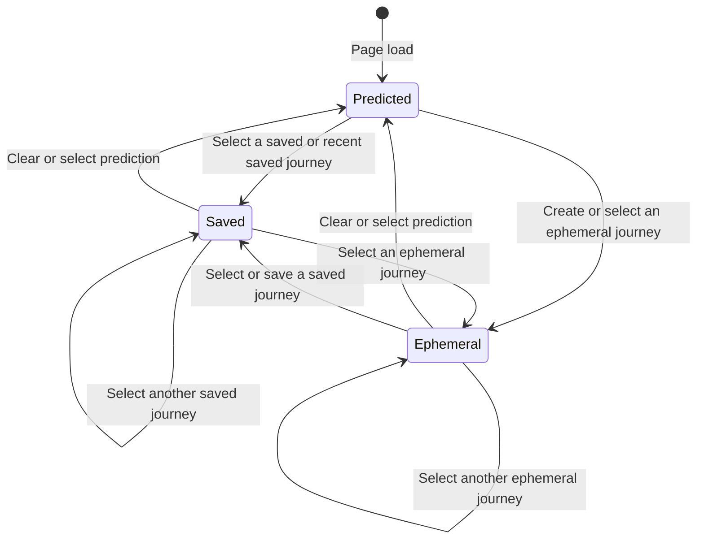
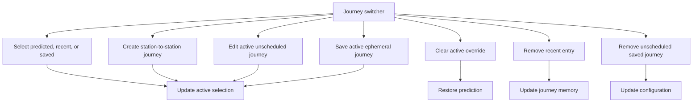

# Journey selection

Journey selection resolves one journey for the dashboard. It does not choose trains or stations.

## Prediction

Only the current schedule supplies a prediction. Recent history does not affect prediction.

## Active selection

The active selection has one of these shapes:

- `{type: "predicted"}` resolves the current predicted journey ID.
- `{type: "saved", id}` resolves one configured journey.
- `{type: "ephemeral"}` resolves the current ephemeral journey.

The active override stays only in the current page session. Page refresh and Clear restore the current prediction.

## Journey switcher actions

Selecting a temporary journey adds its ID to recent history. The switcher shows at most three recent journeys.

Recent history contains journey IDs. Ephemeral definitions remain in journey memory while a recent or active selection refers to them.

Saving an ephemeral journey adds it to the configuration. The active selection then becomes saved.

Only unscheduled saved journeys can be edited or removed from configuration. Removing a recent entry does not remove its saved journey.

## Source map

- `src/trainDashboard/journeys/journeyPrediction.ts` finds the current schedule and predicted journey ID.
- `src/trainDashboard/store/journeySelection.store.ts` owns active selection, recent history, ephemeral journeys, and switcher actions.
- `src/trainDashboard/dto/journeySelection.dto.ts` defines selection and journey-memory shapes.
- `src/trainDashboard/store/dashboardClock.store.ts` supplies the current day and time.
- `src/trainDashboard/store/dashboardConfig.store.ts` supplies schedules and saved journeys.
- `src/trainDashboard/components/journeys/JourneySwitcher.vue` presents journey choices and actions.
- `src/trainDashboard/components/journeys/JourneyForm.vue` creates and edits journey fields.
